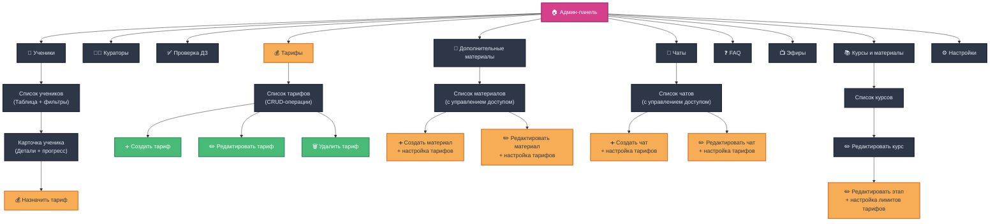

# 🗺 Карта интерфейса админки

---

## 🔒 Права доступа в админке

В Brain Programming существует два типа административных ролей с различными уровнями доступа:

| Действие                     | Admin | Curator |
| ---------------------------- | ----- | ------- |
| Проверка ДЗ                  | ✅     | ✅       |
| Выдача баллов, комментарии   | ✅     | ✅       |
| Управление курсами           | ✅     | ❌       |
| Управление уроками/ступенями | ✅     | ❌       |
| Создание lesson_block        | ✅     | ❌       |
| Назначение кураторов         | ✅     | ❌       |
| Доступ к тарифам/материалам  | ✅     | ❌       |

**Описание ролей:**
- **Admin** - полный доступ ко всем функциям админки, включая управление контентом и назначение кураторов
- **Curator** - ограниченный доступ, сфокусированный на проверке домашних заданий и взаимодействии с пользователями

**Техническая реализация:**
- Роли хранятся в поле `users.role` (значения: 'user', 'curator', 'admin')
- Проверка прав осуществляется через SQL функцию `is_curator_or_admin()`
- В интерфейсе недоступные функции скрываются или блокируются

---

## 1. Dashboard (/admin)
- Общая статистика  
- Краткие виджеты  
  – Количество активных пользователей  
  – Новые сабмити за сутки  
  – Открытые тикеты поддержки  

---

## 2. Ученики (/admin/students) ✅ РЕАЛИЗОВАНО

Этот раздел предназначен для управления всеми учениками платформы. Он заменил предыдущий общий раздел "Пользователи".

### 2.1 Список учеников

Отображается таблица со следующими колонками:

1.  **ФИО** – `users.first_name || ' ' || users.last_name`.

2.  **Telegram-ID / Web-login** – `users.telegram_id` (TEXT) или `users.web_login`.

3.  **Курс** – Активный курс из `user_course_enrollments.course_id → courses.title`.

4.  **Дата регистрации** – `users.created_at`.

5.  **Дата последнего входа** – `users.last_login` или `users.web_last_login`.

6.  **Баллы** – `users.total_points`.

7.  **Процент завершённых уроков** – Динамический подсчет (кол-во завершенных уроков с ДЗ / общее кол-во уроков с ДЗ на курсе) * 100%.

8.  **% просмотра библиотечных материалов** – Динамический подсчет (кол-во просмотренных материалов / общее кол-во материалов) * 100%.

9.  **Куратор** – ФИО куратора, если назначен (`user_curator`).


**Сортировка:**

*   По «Баллам» (`users.total_points DESC`)

*   По «Дате регистрации» (`users.created_at DESC`)

*   По «Последнему входу» (`users.last_login DESC`)


Действия над строкой (например, переход к карточке) выполняются по клику на строку или через специальную иконку.


### 2.2 Карточка ученика

Детальная страница ученика содержит:


1.  **Основная информация:**

    *   ФИО, Telegram-ID / Web-login.

    *   Роль (обычно 'user', можно не выводить).

    *   Дата регистрации, дата последнего входа.

    *   Текущие баллы (`users.total_points`).

    *   **Текущий тариф:** Выпадающий список для назначения/изменения тарифа пользователя.

    *   Кнопка/действие для **начисления/списания баллов** (открывает стандартный интерфейс редактирования пользователя или специальное модальное окно).


2.  **Курсы:**

    *   Список курсов, на которые зачислен ученик (обычно один активный).

    *   Название курса, дата зачисления.


3.  **Прогресс по курсу:**

    *   Процент завершённых уроков (например, "15 из 30 уроков") с прогресс-баром.


4.  **Список уроков курса (таблица):**

    *   Сгруппированы по стадиям.

    *   Колонки: Стадия, Урок, Дата открытия (`lessons.open_at`), Дедлайн (`lessons.deadline_at`), Статус (`lesson_progress.is_completed`), Дата сдачи (`lesson_progress.completed_at`).

    *   **Действие по уроку:** Кнопка «Сбросить прогресс урока» (удаляет запись из `lesson_progress`).


5.  **Список библиотечных материалов (таблица):**

    *   Колонки: Название материала, Тип, Дата первого просмотра (`user_material_views.first_viewed_at`), Статус просмотра (`user_material_views.is_completed`), Дата последнего просмотра/завершения (`user_material_views.last_viewed_at`).

    *   **Действия по материалу:**

        *   Кнопка «Пометить просмотренным» (создает/обновляет запись в `user_material_views`, устанавливая `is_completed = true`).

        *   Кнопка «Сбросить отметку просмотра» (устанавливает `is_completed = false` или удаляет запись в `user_material_views`).

graph TD;
    A[Админ-панель] --> B["Таб Ученики"];
    B --> C["Список учеников (Таблица)<br/>- ФИО<br/>- TG ID/Web-login<br/>- Курс<br/>- Баллы<br/>- % Уроков<br/>- % Материалов<br/>- Куратор<br/>- Сортировка"];
    C -- "Клик по ученику" --> D["Карточка ученика: ID_УЧЕНИКА"];

    D --> D1["<b>Основная инфо:</b><br/>- ФИО, Контакты<br/>- Регистрация, Посл. вход<br/>- Баллы<br/>- Текущий тариф"];
    D -- Действие --> DA1["Изменить баллы (ред. пользователя)"];
    D -- Действие --> DA1A["Назначить тариф"];
    
    D --> D2["<b>Курсы:</b><br/>- Название курса<br/>- Дата зачисления"];
    
    D --> D3["<b>Прогресс по курсу:</b><br/>- X из Y уроков<br/>- Прогресс-бар"];
    
    D --> D4["<b>Список уроков курса (Таблица):</b><br/>- Стадия, Урок, Даты, Статус<br/>(Сгруппированы по стадиям)"];
    D4 -- "Действие" --> DA2["Сбросить прогресс урока (ID_УРОКА)"];
    
    D --> D5["<b>Список библиотечных материалов (Таблица):</b><br/>- Название, Тип, Даты, Статус"];
    D5 -- "Действие" --> DA3["Пометить материал просмотренным (ID_МАТЕРИАЛА)"];
    D5 -- "Действие" --> DA4["Сбросить отметку просмотра (ID_МАТЕРИАЛА)"];

    classDef default fill:#2D3748,stroke:#1A202C,stroke-width:2px,color:#E2E8F0;
    classDef pink fill:#D53F8C,stroke:#97266D,stroke-width:2px,color:white;
    classDef yellow fill:#ECC94B,stroke:#B7791F,stroke-width:2px,color:#2D3748;
    classDef green fill:#48BB78,stroke:#2F855A,stroke-width:2px,color:white;
    
    class A,B,C,D pink;
    class D1,D2,D3,D4,D5 yellow;
    class DA1,DA2,DA3,DA4 green;

---


## 2.A. Кураторы (/admin/curators) ✅ ПОЛНОСТЬЮ РЕАЛИЗОВАНО

Этот раздел предназначен для управления кураторами и их связями с учениками.

### 2.A.0 Создание куратора ✅ РЕАЛИЗОВАНО

**Кнопка "Добавить куратора"** на странице списка кураторов открывает модальное окно с формой создания:

**Поля формы:**
- **Имя** (опционально) - `first_name`
- **Фамилия** (опционально) - `last_name`  
- **Логин** (обязательно) - `web_login` (только буквы, цифры, _, -)
- **Пароль** (обязательно) - минимум 8 символов

**Логика создания:**
- ✅ **Валидация полей:** Проверка обязательных полей и формата логина
- ✅ **Проверка уникальности:** Логин должен быть уникальным в системе
- ✅ **Хеширование пароля:** Автоматическое шифрование через SQL функцию `create_curator`
- ✅ **Создание записи:** Новый пользователь с ролью 'curator' в таблице `users`
- ✅ **Обновление списка:** Автоматическое обновление списка кураторов после создания

**Техническая реализация:**
- Хук: `useCuratorsAdmin.createCurator()`
- SQL функция: `public.create_curator(p_web_login, p_web_password, p_first_name, p_last_name)`
- Компонент: `CuratorsManager.tsx` с полной формой и обработкой ошибок

### 2.A.1 Список кураторов

Отображается таблица со следующими колонками:

1.  **ФИО** – `users.first_name || ' ' || users.last_name` (для пользователей с `role = 'curator'`).

2.  **Telegram-ID / Web-login** – `users.telegram_id` или `users.web_login`.

3.  **Кол-во учеников** – Количество учеников, закрепленных за данным куратором (из `user_curator`).

4.  **Действия** – Кнопка «Открыть карточку куратора», Кнопка «Назначить ученика».

**Дополнительные элементы:**
- ✅ **Кнопка "Добавить куратора"** - в заголовке раздела для создания новых кураторов

Сортировки и фильтры на данном этапе не предусмотрены.


### 2.A.2 Карточка куратора

Детальная страница куратора содержит:


1.  **Основная информация:**

    *   ФИО, Telegram-ID / Web-login.

    *   Дата регистрации, дата последнего входа.

    *   Общее количество назначенных учеников.


2.  **Список «Мои ученики» (таблица):**

    *   Колонки: ФИО ученика, Telegram-ID ученика, Название курса ученика, % завершения курса учеником.

    *   **Действие по ученику:** Кнопка «Открыть профиль ученика» (переход на карточку ученика `/admin/students/{studentId}`).

    *   **Действие по ученику:** Кнопка «Отвязать ученика» (удаляет запись из `user_curator`).


3.  **Действия на карточке куратора:**

    *   **Кнопка «Назначить ученика»:**

        *   Открывает модальное окно с полнофункциональным поиском.

        *   В модальном окне отображается список всех пользователей с ролью 'user', которые еще не закреплены ни за одним куратором (уникальность назначений).

        *   **✅ РЕАЛИЗОВАННЫЙ поиск/фильтрация:** 
            - Поиск по ФИО, Telegram ID и названию курса в реальном времени
            - Техническая реализация через `Fuse.js` с threshold 0.3
            - Автоматическое обновление результатов при вводе

        *   **✅ РЕАЛИЗОВАННАЯ логика назначения:**
            - Выбор ученика и подтверждение назначения (создает запись в `user_curator`)
            - Модальное окно остается открытым после назначения для назначения следующих учеников
            - Назначенный ученик автоматически исчезает из списка доступных
            - Автоматическое обновление карточки куратора

        *   **✅ РЕАЛИЗОВАННАЯ проверка уникальности:**
            - Проверка, что ученик не назначен другому куратору при попытке назначения
            - Отображение только свободных учеников в модальном окне

    *   Кнопка «Вернуться в список кураторов».

graph TD;
  A["Вкладка 'Кураторы'"] --> B["Список кураторов<br/>- ФИО<br/>- Telegram-ID / Web-login<br/>- Кол-во учеников<br/>- Кнопка 'Открыть'<br/>- Кнопка 'Назначить ученика'"];
  
  A --> A1["Кнопка 'Добавить куратора'"];
  A1 --> A2["Модальное окно создания куратора"];
  A2 --> A3["Форма создания:<br/>- Имя (опц.)<br/>- Фамилия (опц.)<br/>- Логин (обяз.)<br/>- Пароль (обяз.)"];
  A3 --> A4["Валидация и создание"];
  A4 --> A5["SQL функция create_curator"];
  A5 --> A6["Обновление списка кураторов"];
  
  B --> C["Карточка куратора<br/>- Основная информация<br/>- Список 'Мои ученики'"];
  C --> D["Кнопка 'Назначить ученика'"];
  D --> E["Модальное окно 'Назначить ученика'"];
  E --> F["Поле поиска / фильтрации учеников<br/>(по ФИО или Telegram ID)"];
  E --> G["Список доступных учеников<br/>- ФИО<br/>- Курс<br/>- Кнопка 'Назначить'"];
  G --> H["Нажатие 'Назначить'"];
  H --> I["Создание записи в user_curator"];
  I --> J["Обновление списка 'Мои ученики'"];
  H --> K["Закрытие модального окна"];

  classDef default fill:#2D3748,stroke:#1A202C,stroke-width:2px,color:#E2E8F0;
  classDef create fill:#48BB78,stroke:#2F855A,stroke-width:2px,color:white;
  classDef main fill:#D53F8C,stroke:#97266D,stroke-width:2px,color:white;
  
  class A1,A2,A3,A4,A5,A6 create;
  class A,B,C main;

---

## 3. Проверка ДЗ (/admin/submissions)

### 3.1 Список сабмитов (/admin/submissions)
- **Главная таблица сабмитов (`submissions`):**
  - Колонки: Пользователь, Урок, Ступень, Дата сдачи, Статус, Баллы, Действия
  - Фильтры: 
    - По статусу (pending_review, approved, rejected, submitted, late)
    - По уроку (dropdown с поиском)
    - По ступени (dropdown)
    - По куратору (для админов)
  - Сортировка: по дате сдачи (ASC/DESC), по баллам
  - Действия: Просмотреть детали, Быстрая проверка (для опытных кураторов)
  - Счетчики: "Ожидают проверки: X", "Проверено сегодня: Y"

### 3.2 Детальный просмотр сабмита (/admin/submissions/:submissionId)
- **Breadcrumb:** Проверка ДЗ > [Урок] > [Имя пользователя]
- **Левая панель - Информация о сабмите:**
  - Данные пользователя: имя, фото, статистика (баллы, жизни)
  - Информация об уроке: название, ступень, описание задания
  - **Улучшенное отображение времени сдачи:**
    - Текущая сдача: время последней сдачи
    - Первая сдача: если есть пересдача, с пометкой "(пересдача задания)"
    - Дедлайн урока: для контекста опоздания
    - Статус с учетом динамического определения опоздания
  - Текст ответа пользователя (с форматированием)
  - Прикрепленный файл (если есть):
    - Превью для изображений
    - Ссылка для скачивания для документов
    - Инлайн-плеер для аудио/видео
- **Правая панель - Форма проверки:**
  - **Для новых сабмитов (submitted/pending_review):**
    - Выбор статуса (approved/rejected)
    - Поле баллов (0-100, настраивается)
    - Текстовая область для комментария куратора
    - Кнопки: "Сохранить", "Сохранить и перейти к следующему"
    - **Примечание:** Опоздание определяется автоматически на основе времени первой сдачи и дедлайна урока
  - **Для уже проверенных сабмитов (approved/rejected) - упрощенный интерфейс:**
    - Отображение текущего статуса и истории проверки
    - Система изменения решений с проверкой прав доступа:
      - Кураторы могут изменять только свои проверки
      - Админы могут изменять любые проверки
    - При изменении решения - автоматический пересчет баллов пользователя
    - Упрощенный интерфейс без поля "причина изменения" (для MVP)

### 3.2.1 Логика управления баллами при изменении решения
- **При изменении approved → rejected:**
  - Списать ранее начисленные баллы: `users.total_points -= old_points_awarded`
  - Обновить сабмит: статус = 'rejected', points_awarded = 0
  - Добавить комментарий с причиной отклонения
- **При изменении rejected → approved:**
  - Начислить новые баллы: `users.total_points += new_points_awarded`
  - Обновить сабмит: статус = 'approved', points_awarded = new_points
  - Добавить комментарий с обоснованием принятия
- **При изменении approved → approved (корректировка баллов):**
  - Пересчитать разницу: `diff = new_points - old_points`
  - Скорректировать баллы пользователя: `users.total_points += diff`
  - Обновить points_awarded в сабмите

### 3.2.2 Уведомления при изменении решения
- Отправлять уведомление пользователю о пересмотре задания
- Указывать причину изменения решения
- При списании баллов: объяснять причину и мотивировать на улучшение

### 3.3 Быстрая проверка (модальное окно)
- **Компактная форма для массовой проверки:**
  - Краткая информация: пользователь, урок, текст ответа
  - Быстрые действия: "Принять" (с баллами по умолчанию), "Отклонить"
  - Поле для короткого комментария
  - Кнопки: "Сохранить", "Следующий", "Перейти к детальному просмотру"

### 3.4 История проверок (/admin/submissions/history)
- **Таблица всех проверенных сабмитов:**
  - Колонки: Дата проверки, Куратор, Пользователь, Урок, Статус, Баллы
  - Фильтры: по дате, куратору, статусу решения
  - Экспорт в CSV для отчетности
  - Возможность отменить решение (для админов)

### 3.5 Уведомления и интеграции
- **Система уведомлений (заглушка на первом этапе):**
  - При проверке сабмита → уведомление пользователю в Telegram
  - При накоплении определенного количества баллов → поздравление
  - При отклонении → мотивационное сообщение с советами
- **Интеграция с геймификацией:**
  - Автоматическое начисление баллов в `users.total_points`
  - Логирование событий проверки (для будущих отчетов)

### 3.6 Права доступа
- **Кураторы** могут проверять назначенные им сабмиты или любые (в зависимости от настроек)
- **Кураторы** могут изменять решения по сабмитам, которые они сами проверили
- **Админы** имеют доступ ко всем сабмитам, истории проверок и настройкам
- **Админы** могут изменять решения по любым сабмитам (в том числе проверенным другими кураторами)
- **Пользователи** не имеют доступа к админскому интерфейсу проверки

### 3.7 Логирование изменений решений (для будущей реализации)
- Ведется лог всех изменений статусов сабмитов
- Фиксируется: кто, когда, что изменил, причина
- Возможность просмотра истории изменений в детальном виде
- Экспорт отчетов по изменениям для анализа качества проверок

---

## 4. Курсы и материалы (/admin/courses)

### 4.1 Список курсов
- **Главная таблица курсов:**
  - Колонки: Название, Подзаголовок, Количество ступеней, Дата создания
  - Действия: Просмотреть ступени, Редактировать курс, Удалить курс
  - Кнопка "Добавить курс"

### 4.2 Детали курса → Управление ступенями (/admin/courses/:courseId/stages)
- **Breadcrumb:** Курсы > [Название курса] > Ступени
- **Таблица ступеней (`course_stages`):**
  - Колонки: Название, Описание, Порядок, Кол-во уроков, Разблокировано, Действия
  - Инлайн-редактирование: название, описание, порядок
  - Переключатель разблокировки (`is_unlocked`)
  - Действия: Управление уроками, Редактировать ступень, Удалить ступень
  - Кнопка "Добавить ступень"

### 4.3 Управление уроками ступени (/admin/courses/:courseId/stages/:stageId/lessons)
- **Breadcrumb:** Курсы > [Название курса] > Ступени > [Название ступени] > Уроки
- **Таблица уроков (`lessons`):**
  - Колонки: Название, Описание, Порядок, Блоков контента, Есть ДЗ, Действия
  - Инлайн-редактирование: название, описание, порядок
  - Переключатель ДЗ (`has_assignment`)
  - Действия: Управление блоками, Редактировать урок, Удалить урок
  - Кнопка "Добавить урок"

### 4.4 Управление блоками урока (/admin/courses/:courseId/stages/:stageId/lessons/:lessonId/blocks)
- **Breadcrumb:** Курсы > [Название курса] > Ступени > [Название ступени] > Уроки > [Название урока] > Блоки
- **Таблица блоков (`lesson_blocks`):**
  - Колонки: Заголовок, Тип блока, Контент/URL, Порядок, Действия
  - Типы блоков: text, video, audio, image, pdf
  - Drag & drop для изменения порядка (если легко реализуется) или кнопки ↑↓
  - Действия: Редактировать блок, Удалить блок
  - Кнопка "Добавить блок" с выбором типа

### 4.5 Модальные окна редактирования

#### 4.5.1 Редактирование курса
- Название курса
- Подзаголовок
- Кнопки: Сохранить, Отмена

#### 4.5.2 Редактирование ступени
- Название ступени
- Описание
- Порядковый номер
- Разблокировано (checkbox)
- **Загрузка обложки ступени**
  - FileUploader компонент для загрузки изображений
  - Поддержка JPG, PNG, WEBP форматов
  - Превью текущей обложки в таблице ступеней
  - Сохранение в поле `course_stages.cover_image_path`
  - Интеграция с Supabase Storage в папке `images/`
- Условия разблокировки (опционально для будущего)
- Кнопки: Сохранить, Отмена

#### 4.5.3 Редактирование урока
- Название урока
- Описание
- Порядковый номер
- Есть домашнее задание (checkbox)
- **Загрузка обложки урока**
  - FileUploader компонент для загрузки изображений
  - Поддержка JPG, PNG, WEBP форматов
  - Превью текущей обложки в таблице уроков
  - Сохранение в поле `lessons.cover_image_path`
  - Интеграция с Supabase Storage в папке `images/`
- **Время открытия урока (`open_at`):**
  - **Автоматическое значение по умолчанию:** завтра в 9:00 утра
  - Поле типа `datetime-local` для установки конкретного времени открытия
  - Позволяет настроить точное время, когда урок станет доступен пользователям
- **Дедлайн сдачи задания (`deadline_at`):**
  - **Автоматический расчет:** дата открытия + 2 дня
  - Поле типа `datetime-local` для корректировки дедлайна
  - Используется для определения просроченных сдач и отображения статусов дедлайна
- Кнопки: Сохранить, Отмена

**Логика автоматических значений:**
- При создании нового урока время открытия автоматически устанавливается на завтра в 9:00
- Дедлайн автоматически рассчитывается как дата открытия + 48 часов
- При изменении времени открытия дедлайн пересчитывается автоматически
- После создания урока форма сбрасывается с новыми значениями по умолчанию

**Функции времени:**
- `getDefaultOpenTime()` - возвращает завтрашнюю дату в 9:00
- `calculateDeadline(openAtString)` - добавляет 2 дня к времени открытия
- `utcToLocal()` и `localToUtc()` - конвертация между UTC и локальным временем

**Интеграция с системой дедлайнов:**
- Поле `deadline_at` используется для отображения статусов "Опоздание", "Дедлайн сегодня", "Дедлайн завтра"
- Дедлайн отображается на карточках уроков и страницах уроков для пользователей
- Автоматическое определение опоздания в админке при проверке заданий

#### 4.5.4 Редактирование блока
- Заголовок блока (опционально)
- Тип блока (select: text, video, audio, image, pdf)
- **Для text:** Текстовое содержимое (textarea)
- **Для video:** URL Kinescope
- **Для audio:** Загрузка файла в Supabase Storage
- **Для image:** Загрузка файла в Supabase Storage  
- **Для pdf:** Загрузка файла в Supabase Storage
- Порядковый номер
- Кнопки: Сохранить, Отмена

### 4.6 Система обложек (реализовано)
- **Для уроков:** полностью реализована загрузка, отображение и управление обложками
- **Для ступеней:** реализована загрузка, отображение и управление обложками  
- **CloudFlare R2 интеграция:** Папки `images/` для обложек, `audio/`/`documents/` для блоков
- **Поддерживаемые форматы:** JPG, PNG, WEBP
- **Фолбэк система:** при отсутствии обложки показывается дефолтная заглушка
- **Удаление файлов:** реализована функция `deleteFileFromR2` для очистки неиспользуемых файлов

### 4.6 Права доступа
- **Только админы** могут создавать/редактировать/удалять курсы, ступени, уроки и блоки
- **Только админы** могут загружать и управлять обложками уроков и ступеней
- **Кураторы** имеют доступ только на чтение

---

## 4.A. Дополнительные материалы (/admin/materials) ✅ РЕАЛИЗОВАНО

> ✅ **СТАТУС: ПОЛНОСТЬЮ РЕАЛИЗОВАНО**  
> Все описанные функции реализованы в MaterialsManager.tsx

Эта секция доступна только администраторам (`Admin`). Кураторы (`Curator`) не имеют доступа к управлению дополнительными материалами.

### 4.A.1 Список дополнительных материалов ✅
- **URL:** `/admin` (при выборе вкладки "Материалы")
- **Статус:** ✅ **РЕАЛИЗОВАНО** в MaterialsManager.tsx
- **Отображение:**
    - ✅ Заголовок "Дополнительные материалы"
    - ✅ Панель инструментов (`.admin-toolbar`):
        - ✅ Фильтр по типу материала (`video`, `audio`)
        - ✅ Кнопка "Добавить материал"
    - ✅ Таблица (`.admin-table`) со следующими колонками:
        1.  ✅ **Обложка**: Превью изображения с возможностью загрузки через `FileUploader`
        2.  ✅ **Название**: Название материала (инлайн-редактирование с debounce)
        3.  ✅ **Тип**: Тип материала (бейдж video/audio)
        4.  ✅ **Описание**: Краткое описание (инлайн-редактирование)
        5.  ✅ **Порядок**: Порядковый номер (инлайн-редактирование)
        6.  ✅ **Дата создания**: Автоматическая дата
        7.  ✅ **Действия**:
            -   ✅ Кнопка "Блоки": переход к управлению блоками материала
            -   ✅ Кнопка "Редактировать": открывает модальное окно редактирования
            -   ✅ Кнопка "Удалить": удаляет материал с подтверждением
- **Реализованные действия:**
    - ✅ **Добавить материал**: Модальное окно создания материала
    - ✅ **Инлайн-редактирование**: Изменение названия, описания, порядка прямо в таблице
    - ✅ **Фильтрация**: По типу материала (video/audio/все)
    - ✅ **JavaScript валидация**: Проверка данных перед сохранением

### 4.A.2 Модальное окно создания/редактирования материала ✅
- **Статус:** ✅ **РЕАЛИЗОВАНО** с полной интеграцией FileUploader и управлением доступом по тарифам
- **Компоненты:**
    - ✅ **Секция тарифов:** "Доступно для тарифов" с чекбоксами для каждого тарифа
    - ✅ Заголовок: "Создание материала" / "Редактирование материала"
    - ✅ Форма с полями:
        - ✅ Название материала
        - ✅ Описание материала
        - ✅ Обложка материала:
            - ✅ Превью текущей обложки
            - ✅ `FileUploader` для загрузки новой обложки в CloudFlare R2 (`images/`)
            - ✅ Кнопка "Удалить обложку"
        - ✅ Тип материала (select: 'video', 'audio')
        - ✅ Порядковый номер
    - ✅ Кнопки: "Сохранить" и "Отмена"
- **Логика:**
    - ✅ Создание или обновление записи в таблице `materials`
    - ✅ Загрузка обложки в R2, путь сохраняется в `materials.cover_image_path`
    - ✅ **Сохранение доступов тарифов** в таблице `tariff_material_access`
    - ✅ Валидация обязательных полей

### 4.A.3 Управление блоками материала ✅
- **Статус:** ✅ **РЕАЛИЗОВАНО** с Drag & Drop функциональностью
- **URL:** Внутренняя навигация в AdminPage
- **Переход:** ✅ По кнопке "Блоки" из таблицы материалов
- **Отображение:**
    - ✅ Breadcrumbs для навигации обратно к списку материалов
    - ✅ Заголовок "Блоки материала: [Название материала]"
    - ✅ Панель инструментов с кнопкой "Добавить блок"
    - ✅ Список блоков с **DraggableMaterialBlockRow** компонентами:
        - ✅ Порядковый номер блока
        - ✅ Заголовок блока (если есть)
        - ✅ Тип блока
        - ✅ Краткое превью контента
        - ✅ Действия (редактировать/удалить)
    - ✅ **Drag & Drop перестановка блоков** с автоматическим сохранением порядка
- **Реализованные действия:**
    - ✅ **Добавить блок**: Модальное окно создания блока
    - ✅ **Drag & Drop**: Перестановка блоков с плавными анимациями
    - ✅ **Автосохранение порядка**: При изменении позиции блоков

### 4.A.4 Модальное окно создания/редактирования блока материала ✅
- **Статус:** ✅ **РЕАЛИЗОВАНО** с поддержкой всех типов блоков
- **Компоненты:**
    - ✅ Заголовок: "Создание блока" / "Редактирование блока"
    - ✅ Форма с полями:
        - ✅ Заголовок блока (опционально)
        - ✅ Порядок блока
        - ✅ Тип блока (select: 'text', 'video', 'audio', 'image', 'pdf')
        - ✅ **Динамические поля для контента** в зависимости от типа:
            - ✅ **text**: `textarea` для текстового содержимого
            - ✅ **video**: `input type="url"` для Kinescope URL с валидацией
            - ✅ **audio**: `FileUploader` для загрузки аудио (включая **m4a** поддержку)
            - ✅ **image**: `FileUploader` для загрузки изображений
            - ✅ **pdf**: `FileUploader` для загрузки PDF документов
        - ✅ **Альтернативный ввод URL**: Возможность ручного ввода URL вместо загрузки файла
    - ✅ Кнопки: "Сохранить блок" и "Отмена"
- **Логика:**
    - ✅ Создание или обновление записи в таблице `material_blocks`
    - ✅ Загрузка файлов в CloudFlare R2 (по типам: `images/`, `audio/`, `documents/`)
    - ✅ JavaScript валидация перед сохранением
    - ✅ Превью загруженных файлов

### 4.A.5 Дополнительные реализованные возможности ✅
- ✅ **Поддержка m4a аудио файлов**: Расширенный список acceptedTypes в FileUploader
- ✅ **Debounce инлайн-редактирование**: Автоматическое сохранение изменений с задержкой
- ✅ **Консистентные стили**: Использование существующей CSS системы из AdminPage.css
- ✅ **TypeScript типизация**: Строгая типизация всех компонентов
- ✅ **Обработка ошибок**: Визуальная обратная связь при ошибках сохранения

### 4.A.6 Права доступа ✅
- ✅ **Только администраторы (`Admin`)** могут создавать, редактировать и удалять дополнительные материалы и их блоки
- ✅ Проверка прав осуществляется на уровне UI и API

### 4.A.7 Техническая реализация ✅
- ✅ **Файл:** `src/pages/AdminPage/components/MaterialsManager/MaterialsManager.tsx`
- ✅ **Таблицы БД:** `materials`, `material_blocks`
- ✅ **CloudFlare R2 интеграция:** Папки `images/` для обложек, `audio/`/`documents/` для блоков
- ✅ **Компоненты:** DraggableMaterialBlockRow, FileUploader интеграция
- ✅ **Стили:** Консистентны с остальной админкой

---

## 5. Геймификация (/admin/gamification)
- Правила начисления  
  – Конфиг в виде JSON или формы  
- Ручное изменение  
  – Таблица событий: начисления, списания жизней  
  – Кнопка "Добавить событие"  

---

## 6. Чаты (/admin/chats) ✅ РЕАЛИЗОВАНО

> ✅ **СТАТУС: ПОЛНОСТЬЮ РЕАЛИЗОВАНО**  
> Все описанные функции реализованы в `ChatsManager.tsx`.

Этот раздел предназначен для управления списком Telegram-чатов, доступных пользователям.

### 6.1 Управление чатами

- **UI:** Таблица со списком чатов. Колонки: `Порядок`, `Название`, `Описание`, `Ссылка`, `Действия`.
- **Перетаскивание:** Реализована возможность изменять порядок чатов с помощью drag-and-drop для ручного управления сортировкой.
- **Функционал:**
    - **Создание:** Модальное окно с полями для нового чата (название, описание, ссылка, порядковый номер) + секция управления доступом по тарифам.
    - **Редактирование:** То же модальное окно для изменения существующего чата с настройками тарифов.
    - **Удаление:** Кнопка с подтверждением для безопасного удаления.
- **💰 Управление доступом по тарифам:**
    - Секция "Доступно для тарифов" с чекбоксами для каждого тарифа в модальном окне
    - Отметка тарифа предоставляет доступ к чату пользователям с этим тарифом
    - Чаты без отмеченных тарифов недоступны никому

### 6.2 Техническая реализация
- **Файл:** `src/pages/AdminPage/components/ChatsManager/ChatsManager.tsx`
- **Таблица БД:** `chats`
- **Хук:** `useChatsAdmin` для всей CRUD-логики.
- **Сортировка:** Drag-and-drop обновляет поле `order_num`.

---

## 7. FAQ (/admin/faq) ✅ РЕАЛИЗОВАНО

> ✅ **СТАТУС: ПОЛНОСТЬЮ РЕАЛИЗОВАНО**  
> Все описанные функции реализованы в `FaqManager.tsx`.

Раздел для управления часто задаваемыми вопросами.

### 7.1 Управление FAQ
- **UI:** Таблица со списком вопросов и ответов. Колонки: `Порядок`, `Вопрос`, `Ответ`, `Действия`.
- **Перетаскивание:** Реализована возможность изменять порядок элементов FAQ с помощью drag-and-drop.
- **Функционал:**
    - **Создание:** Модальное окно для добавления нового вопроса и ответа.
    - **Редактирование:** То же модальное окно для изменения существующего элемента.
    - **Удаление:** Кнопка с подтверждением.

### 7.2 Техническая реализация
- **Файл:** `src/pages/AdminPage/components/FaqManager/FaqManager.tsx`
- **Таблица БД:** `faq`
- **Хук:** `useFaqAdmin` для всей CRUD-логики.
- **Сортировка:** Drag-and-drop обновляет поле `order_num`.

---

## 8. Эфиры (/admin/broadcasts) ✅ РЕАЛИЗОВАНО

> ✅ **СТАТУС: ПОЛНОСТЬЮ РЕАЛИЗОВАНО**  
> Все описанные функции реализованы в `BroadcastsManager.tsx`.

Раздел для управления списком прошедших и будущих эфиров и трансляций.

### 8.1 Управление эфирами
- **UI:** Таблица со списком эфиров. Колонки: `Название`, `Дата начала`, `Статус`, `Действия`.
- **Перетаскивание:** Реализована возможность изменять порядок эфиров с помощью drag-and-drop.
- **Функционал:**
    - **Создание:** Модальное окно со всеми полями для анонса нового эфира (`name`, `description`, `broadcast_url`, `start_time`, `status`).
    - **Редактирование:** То же модальное окно для обновления данных, включая добавление ссылки на запись (`recording_url`) после завершения.
    - **Удаление:** Кнопка с подтверждением.

### 8.2 Техническая реализация
- **Файл:** `src/pages/AdminPage/components/BroadcastsManager/BroadcastsManager.tsx`
- **Таблица БД:** `broadcasts`
- **Хук:** `useBroadcastsAdmin` для всей CRUD-логики.

---

## 9. Тарифы (/admin/tariffs) ✅ РЕАЛИЗОВАНО

> ✅ **СТАТУС: ПОЛНОСТЬЮ РЕАЛИЗОВАНО**  
> Все описанные функции реализованы в `TariffsManager.tsx`.

Этот раздел предназначен для управления тарифными планами и настройки доступа к контенту на основе тарифов.

### 9.1 Управление тарифами (CRUD)

- **UI:** Таблица со списком тарифов. Колонки: `Название`, `Код`, `Описание`, `Дата создания`, `Действия`.
- **Функционал:**
    - **Создание:** Модальное окно с полями для нового тарифа (название, код, описание).
    - **Редактирование:** То же модальное окно для изменения существующего тарифа.
    - **Удаление:** Кнопка с подтверждением для безопасного удаления.
- **Валидация:** Название и код обязательны к заполнению.

### 9.2 Назначение тарифа пользователю ✅

- **Где:** В карточке ученика (`StudentsManager` → `StudentCard`)
- **UI:** Выпадающий список "Текущий тариф" с кнопкой "Назначить"
- **Логика:**
    - Загружается список всех доступных тарифов
    - При выборе тарифа создается/обновляется запись в `user_tariffs`
    - Предыдущий активный тариф деактивируется (`is_active = false`)
    - Новый тариф устанавливается как активный (`is_active = true`)

### 9.3 Настройка лимитов для этапов курса ✅

- **Где:** В редактировании этапа (`StagesManager` → при редактировании ступени)
- **UI:** Секция "Доступ по тарифам" с таблицей настроек
- **Поля для каждого тарифа:**
    - **Макс. дней/уроков доступа:** Числовое поле (`tariff_limits.max_days_access`)
    - **Требуется сдача всех ДЗ:** Чекбокс (`tariff_limits.requires_full_prereq`)
- **Логика:** Сохранение создает/обновляет записи в таблице `tariff_limits`

### 9.4 Управление доступом к материалам и чатам ✅

- **Где:** 
    - В формах материалов (`MaterialsManager` → модальное окно создания/редактирования)
    - В формах чатов (`ChatsManager` → модальное окно создания/редактирования)
- **UI:** Секция "Доступно для тарифов" с чекбоксами для каждого тарифа
- **Логика:**
    - Отметка чекбокса создает запись в `tariff_material_access` или `tariff_chat_access`
    - Снятие отметки удаляет соответствующую запись
    - Материалы/чаты без отмеченных тарифов недоступны пользователям

### 9.5 Техническая реализация
- **Файлы:** 
    - `src/pages/AdminPage/components/TariffsManager/TariffsManager.tsx`
    - `src/pages/AdminPage/components/StudentsManager/StudentCard.tsx` (назначение тарифов)
    - `src/pages/AdminPage/AdminPage.tsx` (секция лимитов этапов)
    - `src/pages/AdminPage/components/MaterialsManager/MaterialsManager.tsx` (доступ к материалам)
    - `src/pages/AdminPage/components/ChatsManager/ChatsManager.tsx` (доступ к чатам)
- **Таблицы БД:** `tariffs`, `user_tariffs`, `tariff_limits`, `tariff_material_access`, `tariff_chat_access`
- **Хуки:** `useTariffsAdmin`, `useTariffLimits`, `useMaterialTariffAccess`, `useChatTariffAccess`

---

## 10. Настройки и права (/admin/settings)
- Управление ролями (admin, curator)  
- Логирование входов  
- Интеграции (Webhook Telegram-бота)  

---
# 🚶 Детальный User Flow: Проверка домашнего задания

---

## Цель  
Куратор принимает или возвращает работу, выставляет баллы и оставляет комментарий

---

### 1. Открыть админку → Проверка ДЗ
- Навигация: в sidebar выбрать "Проверка ДЗ"  
- Загружается список сабмитов  

---

### 2. Найти нужную работу
- Применить фильтры:  
  – Урок = "Управление вниманием"  
  – Статус = "pending_review"  
- В списке кликаем по строке  

---

### 3. Просмотр деталей сабмита
- Страница детального просмотра:  
  – Заголовок урока + имя пользователя  
  – Текст ответа  
  – Кнопка "Скачать файл" (если есть)  

---

### 4. Проверка и оценка
- В форме справа:  
  1. Выбрать статус:  
     – Принято ✅  
     – Возврат на доработку 🔄  
  2. Ввести количество баллов  
  3. Написать комментарий к работе  
- Нажать кнопку **"Сохранить"**  

---

### 5. Результат
- Сабмит исчезает из списка "Ожидающие"  
- Пользователь получит уведомление через бот  
- Новая запись в логе активности (при наличии)  

---

# 🚶 Детальный User Flow: Редактирование урока

---

## Цель  
Админ добавляет / меняет контент в уроке

---

### 1. Админка → Курсы и материалы
- В sidebar выбрать "Курсы и материалы"  
- Открыть нужный курс  
- Нажать на нужную ступень  

---

### 2. Работа с блоками урока
- Видим список блоков (order sorted)  
- Добавить новый блок:  
  – Нажать "Добавить блок" → выбрать тип (text, video, audio, pdf, instruction, form)  
  – Ввести заголовок (если есть), контент (текст / URL)  
  – Сохранить  

---

### 3. Изменить порядок
- Навести на блок → перетащить вверх/вниз  
- Порядок автоматически сохраняется  

---

### 4. Редактировать существующий блок
- Нажать на кнопку "✏️" рядом с блоком  
- В модалке изменить заголовок, content_text / content_url, флаги  
- Сохранить изменения  

---

### 5. Удалить блок
- Нажать "🗑️" → подтвердить  
- Блок исчезает из структуры урока  

---

### 6. Проверить финальный вид
- Нажать "Просмотреть урок" → открыть TMA-превью  
- Убедиться, что все блоки в порядке

---

# 🚶 Детальный User Flow: Изменение решения по проверенному заданию

---

## Цель  
Куратор или админ изменяет решение по уже проверенному заданию:
- Отклоняет принятое задание
- Принимает отклоненное задание  
- **Корректирует количество баллов** за принятое задание

---

### 1. Найти проверенное задание
- Админка → Проверка ДЗ  
- Применить фильтры:
  – Статус = "approved" или "rejected"  
  – При необходимости: по уроку, ступени, куратору  
- Кликнуть по нужному сабмиту  

---

### 2. Просмотр проверенного сабмита
- Страница детального просмотра показывает:  
  – Текущий статус (✅ Принято / ❌ Отклонено)
  – Начисленные баллы  
  – Комментарий куратора
  – Дату проверки и имя проверившего куратора
- **Кнопка "🔄 Изменить решение"** (если есть права)

---

### 3. Нажать "🔄 Изменить решение"
- Открывается форма редактирования:
  – Текущий статус подсвечен с текущими баллами
  – Радиокнопки: "Принято" / "Отклонено"  
  – Поле баллов (всегда доступно при статусе "Принято")
  - Поле нового комментария
  - **Обязательное поле**: "Причина изменения решения"
  - Предупреждение: ⚠️ "Баллы пользователя будут пересчитаны"

---

### 4. Сценарии изменений

#### 4.1 Смена статуса: approved → rejected
1. Выбрать "Отклонено"
2. Поле баллов автоматически обнуляется и блокируется
3. Написать новый комментарий с объяснением причины отклонения
4. Указать причину изменения решения
5. **Система автоматически спишет ранее начисленные баллы**

#### 4.2 Смена статуса: rejected → approved  
1. Выбрать "Принято"
2. Ввести количество баллов для начисления
3. Написать позитивный комментарий
4. Указать причину изменения решения
5. **Система начислит указанные баллы пользователю**

#### 4.3 Корректировка баллов: approved → approved (НОВОЕ!)
1. Оставить статус "Принято"
2. **Изменить количество баллов** (может быть больше или меньше текущего)
3. Обновить комментарий (объяснить изменение оценки)
4. Указать причину корректировки:
   - "Пересмотр критериев оценки"
   - "Обнаружены дополнительные достоинства работы"
   - "Исправление ошибки в начислении баллов"
5. **Система пересчитает разницу и скорректирует баланс пользователя**

---

### 5. Логика пересчета баллов

**Формула корректировки:**
```
Разница = Новые_баллы - Текущие_баллы
users.total_points = users.total_points + Разница
```

**Примеры:**
- Было: 80 баллов → Стало: 95 баллов = +15 к балансу пользователя
- Было: 75 баллов → Стало: 60 баллов = -15 к балансу пользователя  
- Было: 85 баллов → Отклонено = -85 к балансу пользователя
- Было: отклонено → 70 баллов = +70 к балансу пользователя

---

### 6. Обязательные поля для изменения

- **Причина изменения решения** (обязательно):
  - "Обнаружена ошибка в первоначальной проверке"
  - "Пересмотр критериев оценки"  
  - "Жалоба пользователя рассмотрена"
  - "Корректировка количества баллов"
  - Или свободный текст

- **Новый комментарий** (опционально):
  - При изменении комментарий полностью заменяет предыдущий
  - Если поле пустое - остается старый комментарий

---

### 7. Сохранить изменения
- Нажать **"Сохранить изменения"**
- Валидация: проверка заполнения причины изменения
- Система автоматически:
  – Пересчитывает баллы пользователя по формуле
  – Обновляет статус и баллы сабмита  
  – Заменяет комментарий на новый (если указан) или оставляет старый
  – Фиксирует время и автора изменения

---

### 8. Результат и уведомления
- Сабмит обновлен с новым статусом и баллами
- Пользователь получает уведомление об изменении (заглушка):
  - При смене статуса: "Результат проверки изменен"
  - При корректировке баллов: "Количество баллов скорректировано"
- Баланс баллов пользователя автоматически скорректирован

---

### 9. Проверка прав доступа
- **Кураторы** могут изменять только свои решения (где reviewed_by_curator_id = их ID):
  - Могут менять статус approved ↔ rejected
  - **Могут корректировать количество баллов** у принятых заданий
  - Полный функционал изменения решений для своих сабмитов
- **Админы** могут изменять любые решения:
  - Могут менять статус approved ↔ rejected  
  - **Могут корректировать количество баллов** у принятых заданий
  - Полный функционал изменения решений для всех сабмитов
- При попытке куратора изменить чужое решение → кнопка "Изменить решение" не отображается
- Ограничений по времени на изменение решений нет

---

# 🗺 Общая диаграмма навигации админ-панели


