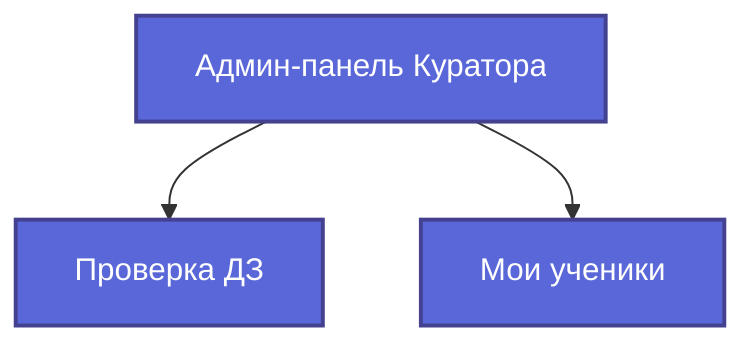

# 🗺️ User Flow для Роли "Куратор"
*Обновлено: 30.06.2025 - Добавлен полный доступ к просмотру материалов*

## 🎯 Основная концепция

Интерфейс административной панели для роли **"Куратор"** максимально упрощен и сфокусирован на двух ключевых задачах:

1.  **Проверка домашних заданий (ДЗ)** от закрепленных за ним учеников.
2.  **Просмотр прогресса** своих учеников.

Чтобы не перегружать интерфейс, вкладки для **управления** контентом (курсами, материалами, тарифами) для куратора **скрыты**. 

Однако, для эффективной поддержки учеников, кураторы имеют **полный доступ на просмотр** всех учебных материалов (ступеней и уроков), обходя ограничения по тарифам.

## 🧭 Структура навигации

Админ-панель для куратора будет состоять всего из **двух основных вкладок (табов)**:

1.  **Проверка ДЗ**
2.  **Мои ученики**



---

## 1. Вкладка "Проверка ДЗ" (`/admin/submissions`)

Это основной рабочий экран куратора.

-   **Цель**: Быстро находить, проверять и оценивать домашние задания.
-   **Содержимое**:
    -   Таблица со списком заданий, ожидающих проверки (`submissions`).
    -   **Важное ограничение**: В списке отображаются задания **только от учеников, назначенных данному куратору**.
    -   **Фильтры**: По статусу (`pending_review`, `approved`, `rejected`), по уроку, по ученику (из списка своих).
    -   **Действия**:
        -   При клике на задание открывается детальный просмотр.
        -   В режиме просмотра куратор может выставить баллы, написать комментарий и изменить статус.
        -   Куратор может изменять решение **только по тем заданиям, которые он сам проверил**.

---

## 2. Вкладка "Мои ученики" (`/admin/students`)

Раздел для отслеживания прогресса подопечных.

-   **Цель**: Мониторить успеваемость и активность учеников.
-   **Содержимое**:
    -   Таблица со списком учеников.
    -   **Важное ограничение**: В списке отображаются **только ученики, закрепленные за текущим куратором** (через `user_curator`).
    -   **Колонки**: ФИО, % прохождения курса, Баллы, Дата последнего входа.
    -   **Действия**:
        -   Клик по ученику открывает его карточку в режиме **"только для чтения"**.
        -   Куратор не может изменять данные ученика, назначать тарифы или сбрасывать прогресс. Он может только просматривать информацию о прохождении уроков и материалов.

---

## 🔒 Права доступа (Summary)

| Действие                        | Куратор (Curator)                                 |
| ------------------------------- | ------------------------------------------------- |
| Проверка ДЗ (своих учеников)    | ✅ Да                                               |
| Изменение *своего* решения по ДЗ | ✅ Да                                               |
| Просмотр *своих* учеников        | ✅ Да                                               |
| **Просмотр ВСЕХ материалов**    | ✅ **Да (без ограничений)**                         |
| Управление курсами/уроками      | ❌ Нет                                              |
| Управление тарифами/материалами | ❌ Нет                                              |
| Управление пользователями/ролями | ❌ Нет                                              |
| Просмотр чужих учеников/ДЗ      | ❌ Нет                                              |

Этот подход обеспечивает простоту, безопасность и концентрацию куратора на его главных обязанностях.

---

## 🖼️ UI-компоненты

### Компонент `CuratorAdminPage`

Основная обёртка для админки куратора, использует существующий `TabBar` и роутинг React Router.
```tsx
import React from 'react';
import { Routes, Route } from 'react-router-dom';
import TabBar from '@/components/ui/TabBar';
import SubmissionsManager from '@/pages/AdminPage/SubmissionsManager';
import StudentsManager from '@/pages/AdminPage/components/StudentsManager/StudentsManager';

const CuratorAdminPage: React.FC = () => (
  <>
    <TabBar
      tabs=[
        { label: 'Проверка ДЗ', to: '/admin/submissions' },
        { label: 'Мои ученики', to: '/admin/students' }
      ]
    />
    <Routes>
      <Route path="/admin/submissions" element={<SubmissionsManager />} />
      <Route path="/admin/students" element={<StudentsManager />} />
    </Routes>
  </>
);

export default CuratorAdminPage;
```

### `SubmissionsManager`

Использовать существующий `SubmissionsManager.tsx`, но без колонки **"Куратор"**:
- В `<thead>` удалить `<th>Куратор</th>`.
- В `<tbody>` удалить ячейку с выводом `submission.reviewer_name`.

Остальные столбцы и логика сохраняются как у админа.

### `StudentsManager`

Использовать существующий `StudentsManager.tsx` без изменений в структуре — таблица и пагинация остаются идентичными админской версии.

### Состояния и Ошибки

- Вариант загрузки: использовать `<div className="admin-loading">`.
- Вариант ошибки: использовать `<div className="admin-error">`.

### Компоненты UI

- Использовать компоненты из `src/components/ui/` (кнопки, таблицы, модалки).
- Не вводить новых стилей и классов, применять существующие utility-классы Tailwind через UI-компоненты.
