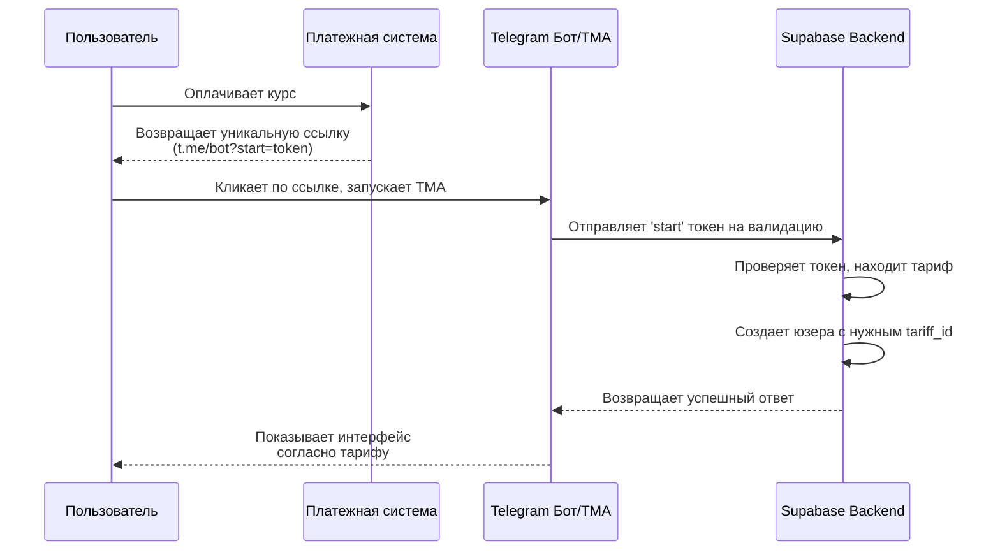

# Реализация: Автоматическое назначение тарифа по токену

## 1. Назначение

Этот документ описывает процесс автоматической регистрации пользователя в системе и назначения ему соответствующего тарифа при первом запуске Telegram-бота/TMA. Механизм основан на использовании уникальных одноразовых токенов, которые встроены в стартовую ссылку.

**Цель:** Устранить ручное назначение тарифов администратором, повысить скорость и надежность онбординга новых студентов после оплаты.

## 2. Общая схема процесса

## 3. Пользовательский флоу

1.  **Оплата:** Пользователь совершает покупку на внешнем ресурсе (сайт, платежная система).
2.  **Получение ссылки:** После успешной оплаты система-продавец генерирует и показывает пользователю уникальную ссылку вида `t.me/your_bot_name?start=a1b2c3d4e5f6`.
3.  **Первый запуск:** Пользователь переходит по этой ссылке, что запускает Telegram-бота и открывает TMA.
4.  **Автоматическая активация:** Приложение автоматически считывает стартовый параметр (`a1b2c3d4e5f6`), отправляет его на бэкенд, и система мгновенно настраивает аккаунт пользователя с правильным тарифом. Пользователь сразу видит нужный контент.

## 4. Техническая реализация (Backend & Frontend)

### 4.1. Подготовка: Таблица для токенов

Для хранения и управления токенами необходимо создать новую таблицу в БД.

**Таблица `activation_tokens`:**
*   `id` (uuid, PK)
*   `token` (text, UNIQUE, NOT NULL) - Сам уникальный токен.
*   `tariff_id` (uuid, FK -> tariffs.id, NOT NULL) - Тариф, который будет назначен.
*   `is_used` (boolean, default: false, NOT NULL) - Статус использования токена.
*   `created_at` (timestamptz) - Дата создания токена.
*   `activated_at` (timestamptz, nullable) - Дата активации.
*   `activated_by_user_id` (uuid, FK -> users.id, nullable) - Какой пользователь активировал.

### 4.2. Генерация токена

Процесс генерации токена происходит на стороне платежной системы или на нашем бэкенде по вебхуку от нее.

*   После успешной оплаты платежная система отправляет вебхук на нашу Supabase Edge Function (`create-activation-token`).
*   Эта функция генерирует уникальную строку (`token`), получает ID тарифа из запроса и создает новую запись в таблице `activation_tokens`.
*   Платежная система в ответ на вебхук получает сгенерированный токен и формирует для пользователя конечную ссылку.

### 4.3. Активация токена (Frontend + Edge Function)

1.  **Frontend (TMA):**
    *   При инициализации приложение проверяет `window.Telegram.WebApp.initDataUnsafe.start_param`.
    *   Если `start_param` существует, приложение вызывает RPC-функцию или Edge Function в Supabase, например, `activate_user_by_token`, и передает ей этот токен.

2.  **Backend (Edge Function `activate_user_by_token`):**
    *   **Получает токен** от клиента.
    *   **Находит токен** в таблице `activation_tokens`.
    *   **Проверяет:**
        *   Существует ли токен?
        *   `is_used` равно `false`?
        *   Если нет, возвращает ошибку "Недействительный или уже использованный токен".
    *   **Создает пользователя:** Если токен валиден, функция создает новую запись в `public.users`, используя данные из `initData` (telegram_id, first_name и т.д.).
    *   **Назначает тариф:** Создает запись в `user_tariffs`, связывая нового пользователя (`user.id`) и тариф (`token.tariff_id`).
    *   **Помечает токен как использованный:** Обновляет запись в `activation_tokens`, устанавливая `is_used = true`, `activated_at = now()`, `activated_by_user_id = new_user.id`.
    *   **Возвращает успех:** Отправляет на клиент подтверждение, что пользователь успешно создан и активирован.

Этот подход обеспечивает безопасность, надежность и полную автоматизацию процесса онбординга.
