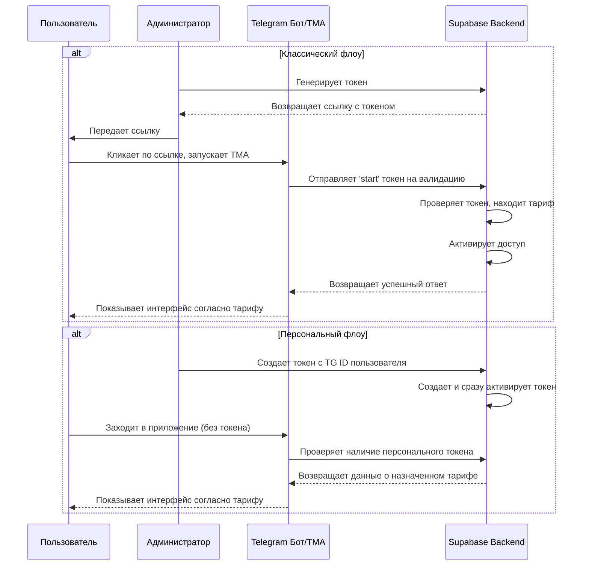

# Реализация: Система токенов доступа

## 1. Назначение

Этот документ описывает процесс автоматической регистрации пользователя в системе и назначения ему соответствующего тарифа. Механизм основан на использовании уникальных одноразовых токенов.

**Цель:** Устранить ручное назначение тарифов администратором, повысить скорость и надежность онбординга новых студентов.

**Поддерживаемые флоу:**
1.  **Классический (по ссылке):** Пользователь получает ссылку `t.me/bot?start=TOKEN`, переходит по ней и активирует доступ.
2.  **Персональный (автоматический):** Администратор создает токен, привязанный к Telegram ID пользователя. При следующем входе пользователя в приложение доступ активируется автоматически.

## 2. Общая схема процесса

## 3. Техническая реализация (Backend & Frontend)

### 3.1. Таблица `access_tokens`

Используется существующая таблица `access_tokens` с добавленным полем `tg_id` для персональных токенов.

### 3.2. Генерация токенов (Админ-панель)

-   **Обычные токены:** Администратор выбирает курс, тариф, количество. Система генерирует ссылки для распространения.
-   **Персональные токены:** Администратор выбирает курс, тариф и вводит `Telegram ID` пользователя. Система создает токен и немедленно его активирует.

### 3.3. Активация токенов

**На стороне Frontend (TMA):**
1.  При инициализации приложение проверяет `window.Telegram.WebApp.initDataUnsafe.start_param`.
2.  **Если `start_param` есть:** вызывается RPC `redeem_access_token` для активации.
3.  **Если `start_param` отсутствует:** вызывается RPC `find_token_by_tg_id`, чтобы проверить, был ли пользователю назначен персональный токен. Если да, доступ уже предоставлен, и приложение загружает данные о тарифе.
4.  Если ни токена в ссылке, ни персонального токена не найдено, отображается страница с ошибкой.

**На стороне Backend (RPC-функции):**
-   `redeem_access_token(token)`: Валидирует и активирует обычный токен.
-   `assign_access_token_to_user(tg_id, tariff_id, ...)`: Создает и сразу активирует персональный токен.
-   `find_token_by_tg_id(tg_id)`: Ищет неиспользованные персональные токены для пользователя.

Этот гибридный подход обеспечивает как массовое распространение доступов через ссылки, так и целевое назначение тарифов конкретным пользователям.
